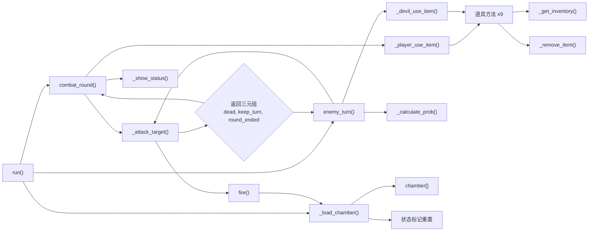
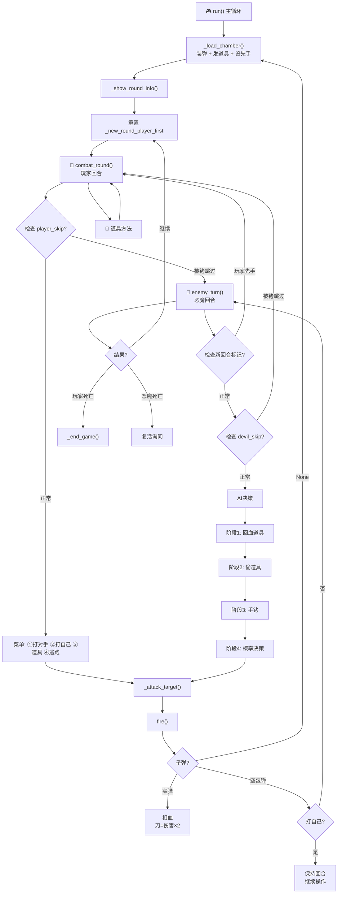

# -纯文字恶魔轮盘赌

赛博小垃圾，本来打算全部自己写的，最后一些功能有想法但是不会实现，还是用到了ai，还是存在对象混淆不清，多余类之类一系列问题
学到的东西：1.在写代码前整体的架构其实更为重要，我总是想不全，等要用手机和啤酒的时候再想到枪膛，在要用肾上腺素的时候才想到物品栏，这样思路不是顺的，会来回往返，之前也没有经验。因此应该在写之前完完整整的描述自己所需要的所有功能，先画出这个思维导图，然后会看的更清晰
           2.很多ai新创建的变量和函数，只是正常的用法，但是我还是想不到，比如 _devil_calculate_real_probability，对恶魔计数只有模糊的认识，看过结果之后其实不复杂，但归根结底问题的关键还是自己想出来
